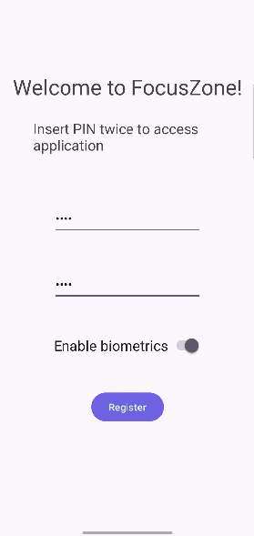
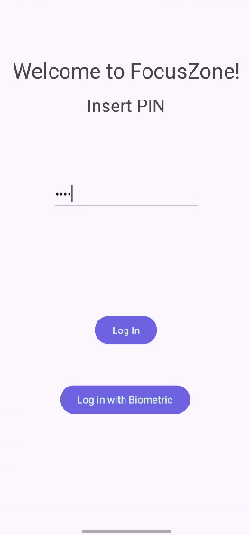
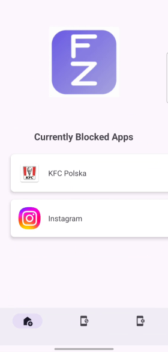
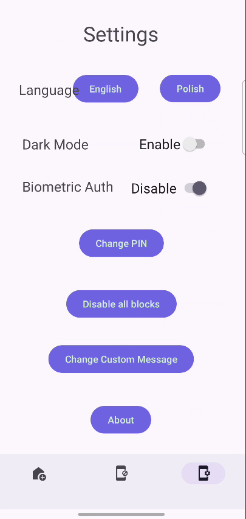
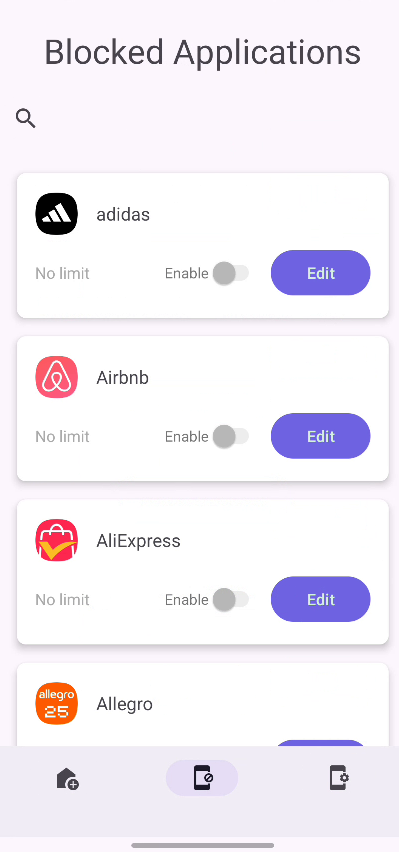
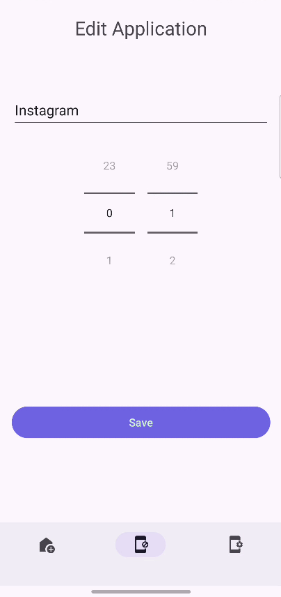

Programowanie urządzeń mobilnych laboratorium L_1

# Dokumentacja projetu: Aplikacja FocusZone

## Zespoł projetowy:
_Mateusz Bocak
Gabriela Bieniek_

## Opis projektu

FocusZone to aplikacja mobilna na Androida, której celem jest pomoc użytkownikom w zarządzaniu czasem spędzanym na urządzeniach mobilnych. Dzięki blokowaniu aplikacji oraz ustawianiu limitów czasowych, FocusZone wspiera budowanie zdrowych nawyków i ograniczanie rozpraszaczy.

## Zakres projektu opis funkcjonalności:

- **Blokowanie aplikacji**:
    - Ustawianie dziennego limitu czasu i ich ilości dla wybranych aplikacji.
    - Blokada aplikacji po przekroczeniu ustawionego limitu.

- **Personalizacja komunikatów blokady**:
    - Dostosuj pełnoekranowe wiadomości wyświetlane przed otwarciem aplikacji lub strony.

- **Logowanie**:
    - Bezpieczny dostęp do aplikacji dzięki PIN'u/biometrii (odcisk palca, rozpoznawanie twarzy).

- **Wyłączenie blokad blokad**:
  - Tryb "Emergency" - wyłącza obecne limity i blokady.

## Panele / zakładki aplikacji 

- Panel rejestracji

- Panel logowania

- Ekran główny

- Ustawienia

- Widok dostępnych aplikacji

- Edytuj limit dla aplikacji

## Baza danych

Aplikacja nie posiada bazy danych w rozumieniu relacyjnym.

Wszystkie dane zapisywane są w `sharedPreferences` pod odpowiednimi kluczami. Nie wszysktie potrzebują pełnych operacji CRUD.

Do zarządzania nimi została stworzona klasa `PreferenceManager`.

## Wykorzystane uprawnienia aplikacji i API android do:

- AccessablilityService                       - blokowanie aplikacji i stron w wybranych przeglądarkach
- Powiadomienia (POST_NOTIFICATIONS)          - powiadomienia o monitorowaniu i blokowaniu
- Biometric Authentication (USE_BIOMETRIC)    - autentykacja za pomocą systemowej biometrii
- Foreground Service (FOREGROUND_SERVICE)     - uruchomienie procesu monitorowania w tle nawet gdy aplikacja zostanie wyłączona
- System alert (SYSTEM_ALERT_WINDOW)          - Wyświelenie komunikatu z personalizowanym komunikatem

##[Plik instalacyjny](./app/build/intermediates/apk/debug/apk-debug.apk)
